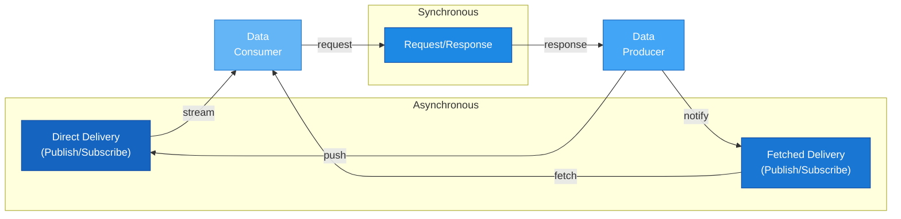
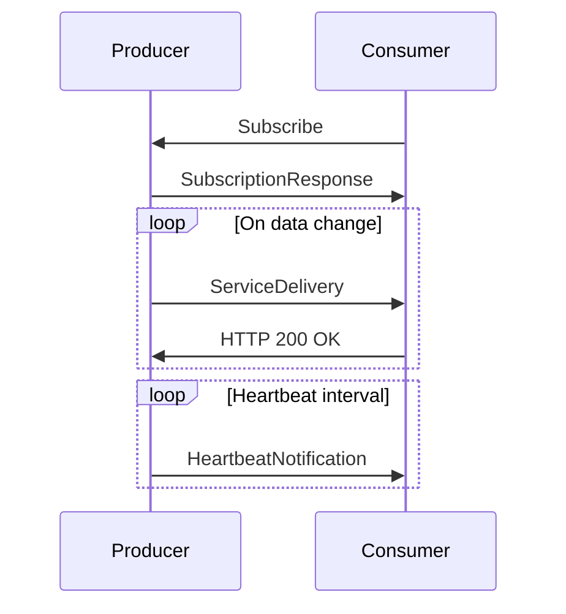
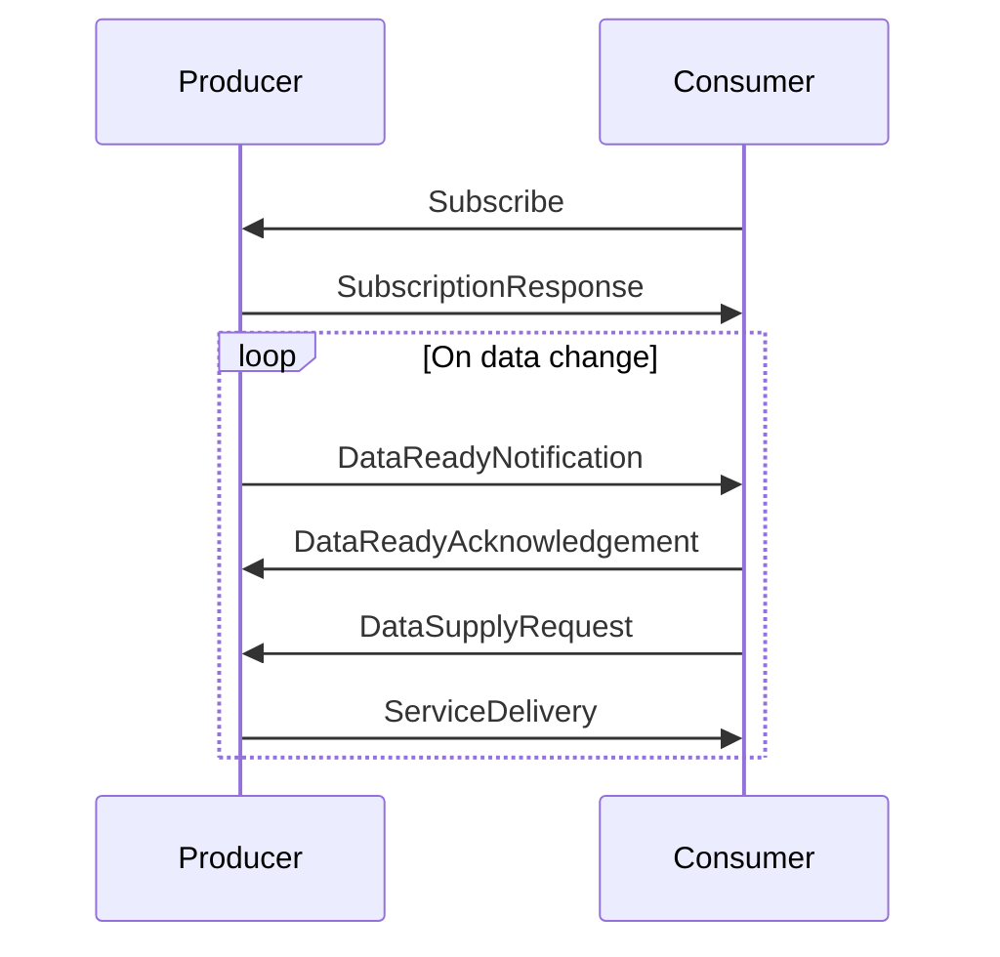
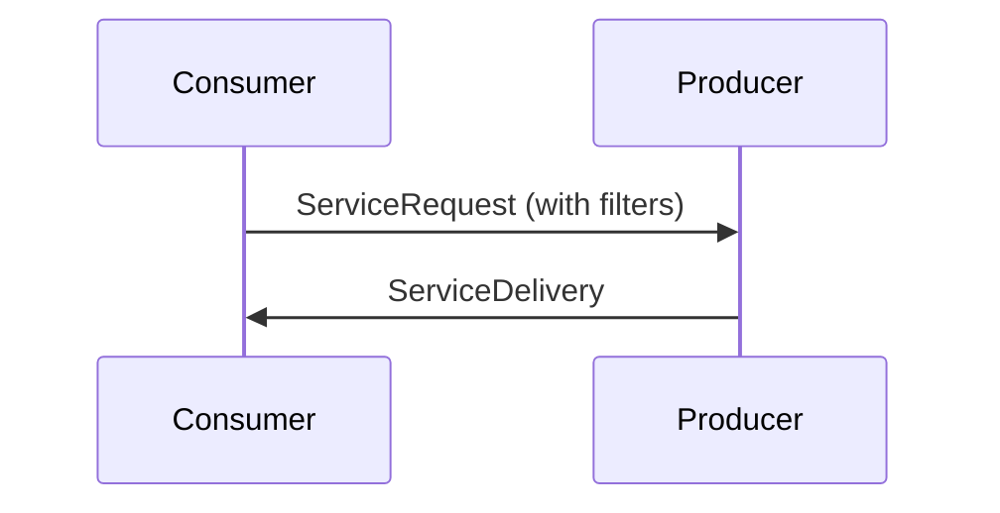

# 🔄 Data Exchange Patterns

## 1. Overview

Communication of SIRI data must be implemented via REST-based services over HTTP. The exchange mechanism is identical for all service types (SIRI-ET, SIRI-SX, SIRI-VM).

Three forms of data acquisition are supported:

---

## 2. Asynchronous — Publish/Subscribe

The service continuously delivers data updates to all subscribed consumers. All Publish/Subscribe services must send **heartbeats** in accordance with the subscription request (`HeartbeatInterval`) to verify service availability.

### Direct Delivery

Data is continuously streamed to all subscribers immediately after release. The recipient acknowledges with HTTP 200 "OK".

### Fetched Delivery

Data is only sent when the receiving system has verified it is ready. The producer must keep data available until the consumer has explicitly fetched it.

---

## 3. Synchronous — Request/Response

Explicit fetching of datasets based on service type, time, and filtering parameters.

---

## 4. General Requirements

### Standard Values
All fields used when setting up a data stream or calling services must have meaningful values, defaults, and comply with request parameters (time intervals, filtering, change-before-update).

### Data Correctness

> [!WARNING]
> - Data must comply with requirements in the Nordic SIRI Profile
> - Data should be semantically appropriate and interpretable by consumers
> - Empty data must not be submitted, even when technically not prohibited
> - Published real-time information must contain **genuine updates**
> - Test or dummy data must **never** be published in production environments

### Data Completeness
Real-time data builds upon NeTEx planned data, which it supports, enriches, or replaces. However, each SIRI message should be complete and self-contained within its XML file.

### Data Content
When no input parameters are present in a request, a full dataset is expected. When parameters are specified, data is filtered accordingly.

### Data Freshness
New messages should be published as soon as feasible after source data changes:
- Changes in stops (EstimatedCall → RecordedCall)
- Quay determination or changes
- Adjustments in estimated arrivals or departures

> [!TIP]
> Normal data deliveries should contain only updates/changes since the most recent push/request. If messages contain previously delivered data, mechanisms must prevent duplication.
