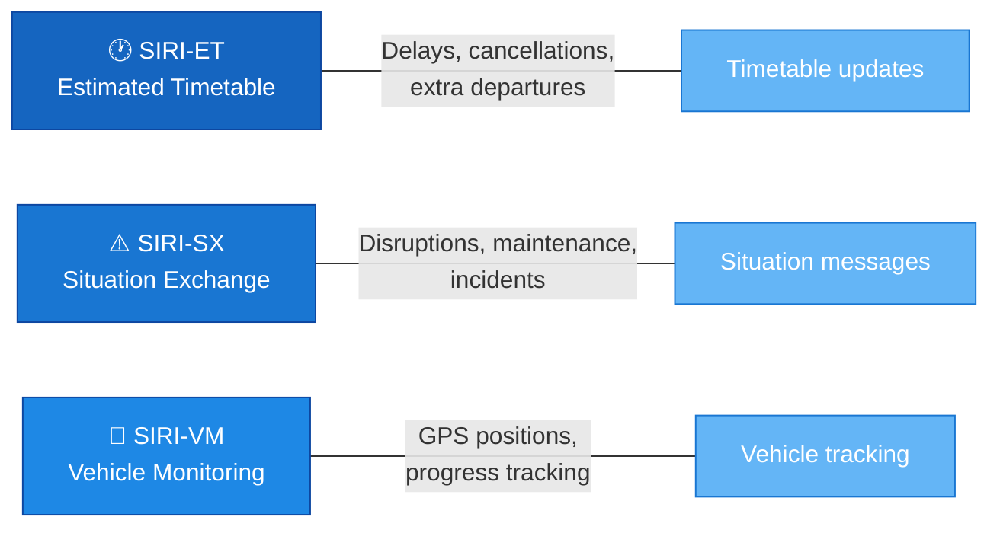
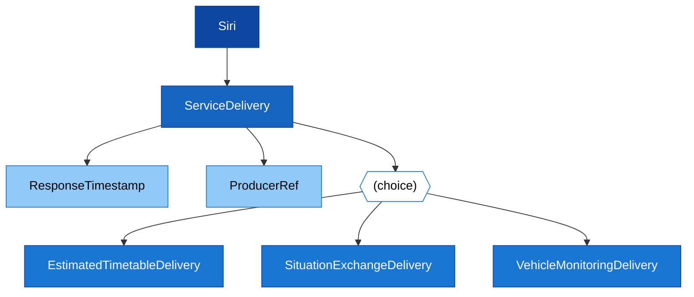

# 🚀 Get Started with the Nordic SIRI Profile

## What is SIRI?

**Service Interface for Real Time Information (SIRI)** is a European CEN standard (CEN/TS 15531) for exchanging real-time public transport data between computer systems. It provides a standardised format for vehicle positions, estimated arrival times, and disruption messages.

> [!NOTE]
> SIRI updates **planned data** delivered via NeTEx. You need valid NeTEx timetable data before SIRI real-time data becomes meaningful.

---

## The Nordic SIRI Profile

The Nordic SIRI Profile is a localisation of SIRI 2.0 for the Nordic countries. It specifies:
- **Which** SIRI services to use (ET, SX, VM)
- **Which** data elements are mandatory or optional
- **How** to reference planned data (NeTEx IDs, national stop place registry)

### Three services at a glance



| Service | What it does | When to use |
|---------|-------------|-------------|
| [SIRI-ET](../../Services/SIRI-ET/Description_SIRI-ET.md) | Updates timetable data with delays, cancellations, additional departures | Same operating day changes |
| [SIRI-SX](../../Services/SIRI-SX/Description_SIRI-SX.md) | Distributes textual situation messages about disruptions | Planned/unplanned incidents |
| [SIRI-VM](../../Services/SIRI-VM/Description_SIRI-VM.md) | Reports vehicle positions and progress | Real-time vehicle tracking |

---

## XML Structure

Every SIRI message follows the same top-level structure:

```xml
<Siri xmlns="http://www.siri.org.uk/siri" version="2.0">
    <ServiceDelivery>
        <ResponseTimestamp>2024-01-15T10:30:00</ResponseTimestamp>
        <ProducerRef>OPERATOR</ProducerRef>
        
        <!-- One of: -->
        <EstimatedTimetableDelivery>...</EstimatedTimetableDelivery>
        <SituationExchangeDelivery>...</SituationExchangeDelivery>
        <VehicleMonitoringDelivery>...</VehicleMonitoringDelivery>
    </ServiceDelivery>
</Siri>
```



---

## How IDs Connect SIRI to NeTEx

All SIRI data references planned NeTEx objects using their IDs. This is how real-time data enriches planned data:

| SIRI Reference | Points to NeTEx Object | Example |
|---------------|----------------------|---------|
| `LineRef` | Line | `NSB:Line:21` |
| `FramedVehicleJourneyRef` | ServiceJourney + Date | `NSB:ServiceJourney:1-2492-2343` |
| `StopPointRef` | Quay (in national stop registry) | `NSR:Quay:709` |
| `OperatorRef` | Operator | `NSB` |
| `RouteRef` | Route | `NSB:Route:21-Trondheim` |

> [!TIP]
> All stop references must use IDs from the **national stop place registry** (NSR). This ensures consistency across all data providers and consumers.

---

## ID Format

IDs follow the NeTEx codespace pattern:

```
Codespace:ObjectType:Identifier
```

**Examples:**
- `NSB:ServiceJourney:1-2492-2343`
- `NSR:Quay:709`
- `RUT:Line:31`

---

## Next Steps

| What you want to do | Where to go |
|---------------------|-------------|
| Understand the general SIRI framework | [General Information](../GeneralInformation/GeneralInformation_Guide.md) |
| Learn about data exchange patterns | [Data Exchange](../DataExchange/DataExchange_Guide.md) |
| Dive into Estimated Timetable | [SIRI-ET Service](../../Services/SIRI-ET/Description_SIRI-ET.md) |
| Dive into Situation Exchange | [SIRI-SX Service](../../Services/SIRI-SX/Description_SIRI-SX.md) |
| Dive into Vehicle Monitoring | [SIRI-VM Service](../../Services/SIRI-VM/Description_SIRI-VM.md) |
| Look up a specific object | [Table of Contents](../../LLM/Tables/TableOfContent.md) |
