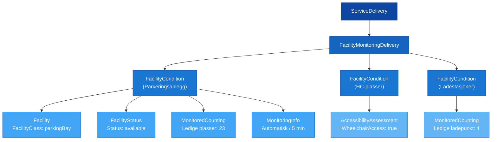

# 🅿️ Implementasjonsguide — Parkering og tilgjengelighet med SIRI-FM

## 1. Innledning

Denne guiden beskriver hvordan SIRI-FM (Facility Monitoring) kan brukes til å overvåke **parkeringsanlegg og deres tilgjengelighet** i sanntid. Guiden dekker alt fra grunnleggende statusrapportering til differensiert plassovervåking, ladeinfrastruktur og universell utforming.

> [!NOTE]
> SIRI-FM bygger på planlagte data levert via NeTEx/IFOPT. Parkeringsanlegg bør være registrert i det nasjonale stoppstedsregisteret (NSR) eller tilsvarende plandata før sanntidsinformasjon leveres.

---

## 2. Konseptoversikt



Hver `FacilityCondition` representerer ett overvåket objekt — enten hele parkeringsanlegget, en delmengde plasser (f.eks. HC-plasser), eller tilknyttet utstyr (f.eks. ladestasjoner).

---

## 3. Klassifisering av parkeringsfasiliteter

### FacilityClass

Alle parkeringsfasiliteter bruker `FacilityClass` med verdien **`parkingBay`**:

```xml
<FacilityClass>parkingBay</FacilityClass>
```

### ParkingFacility (i Features)

`Features` klassifiserer **type** parkeringsanlegg:

| Verdi | Beskrivelse | Typisk bruk |
|-------|-------------|------------|
| `carPark` | Bilparkering | Generell parkeringsplass |
| `parkAndRidePark` | Innfartsparkering | Kollektivknutepunkt |
| `motorcyclePark` | MC-parkering | MC-plasser |
| `cyclePark` | Sykkelparkering | Bysykkel, sykkelhotell |
| `rentalCarPark` | Leiebilparkering | Bildelingsstasjoner |
| `coachPark` | Bussparkering | Turistbussparkering |

```xml
<Features>
    <Feature>
        <ParkingFacility>parkAndRidePark</ParkingFacility>
    </Feature>
</Features>
```

---

## 4. Grunnleggende implementasjon

### Steg 1: Definer fasiliteten

Minimum informasjon for et parkeringsanlegg:

```xml
<Facility>
    <FacilityCode>ENT:Facility:PARK-001</FacilityCode>
    <Description xml:lang="no">Innfartsparkering Helsfyr</Description>
    <FacilityClass>parkingBay</FacilityClass>
    <Features>
        <Feature>
            <ParkingFacility>parkAndRidePark</ParkingFacility>
        </Feature>
    </Features>
    <FacilityLocation>
        <StopPlaceRef>NSR:StopPlace:6442</StopPlaceRef>
    </FacilityLocation>
</Facility>
```

> [!TIP]
> Bruk alltid `StopPlaceRef` for å knytte parkeringsanlegget til det nasjonale stoppstedsregisteret. Dette sikrer at informasjonen kan kobles til reisetjenester.

### Steg 2: Rapporter status

`FacilityStatus` angir den overordnede tilstanden:

```xml
<FacilityStatus>
    <Status>partiallyAvailable</Status>
    <Description xml:lang="no">Begrenset kapasitet, 23 av 200 plasser ledig</Description>
</FacilityStatus>
```

| Statusverdi | Når den brukes |
|-------------|---------------|
| `available` | Alle plasser er ledige / normal drift |
| `partiallyAvailable` | Noen plasser opptatt, men anlegget er åpent |
| `notAvailable` | Fullt / stengt |
| `removed` | Anlegget er midlertidig fjernet |

### Steg 3: Legg til telling

`MonitoredCounting` gir de kvantitative verdiene:

```xml
<MonitoredCounting>
    <CountingType>availabilityCount</CountingType>
    <CountedFeatureUnit>bays</CountedFeatureUnit>
    <Count>23</Count>
    <Trend>decreasing</Trend>
</MonitoredCounting>
```

### Steg 4: Beskriv monitoreringen

`MonitoringInfo` angir hvordan data samles inn:

```xml
<MonitoringInfo>
    <MonitoringInterval>PT5M</MonitoringInterval>
    <MonitoringType>automatic</MonitoringType>
</MonitoringInfo>
```

---

## 5. Komplett eksempel — Grunnleggende parkeringsovervåking

```xml
<Siri xmlns="http://www.siri.org.uk/siri" version="2.0">
  <ServiceDelivery>
    <ResponseTimestamp>2026-04-13T08:30:00+02:00</ResponseTimestamp>
    <ProducerRef>ENT</ProducerRef>
    <FacilityMonitoringDelivery version="2.0">
      <ResponseTimestamp>2026-04-13T08:30:00+02:00</ResponseTimestamp>
      <FacilityCondition>
        <Facility>
          <FacilityCode>ENT:Facility:PARK-001</FacilityCode>
          <Description xml:lang="no">Innfartsparkering Helsfyr</Description>
          <FacilityClass>parkingBay</FacilityClass>
          <Features>
            <Feature>
              <ParkingFacility>parkAndRidePark</ParkingFacility>
            </Feature>
          </Features>
          <FacilityLocation>
            <StopPlaceRef>NSR:StopPlace:6442</StopPlaceRef>
          </FacilityLocation>
        </Facility>
        <FacilityStatus>
          <Status>partiallyAvailable</Status>
        </FacilityStatus>
        <MonitoredCounting>
          <CountingType>availabilityCount</CountingType>
          <CountedFeatureUnit>bays</CountedFeatureUnit>
          <Count>23</Count>
          <Trend>decreasing</Trend>
        </MonitoredCounting>
        <MonitoredCounting>
          <CountingType>inUseCount</CountingType>
          <CountedFeatureUnit>bays</CountedFeatureUnit>
          <Count>177</Count>
          <Trend>increasing</Trend>
        </MonitoredCounting>
        <MonitoringInfo>
          <MonitoringInterval>PT5M</MonitoringInterval>
          <MonitoringType>automatic</MonitoringType>
        </MonitoringInfo>
      </FacilityCondition>
    </FacilityMonitoringDelivery>
  </ServiceDelivery>
</Siri>
```

---

## 6. Differensiert plassovervåking

Ulike plasstyper kan overvåkes separat ved å bruke `TypeOfCountedFeature` for å klassifisere hva som telles. Flere `MonitoredCounting`-elementer i samme `FacilityCondition` gir et komplett bilde.

### HC-plasser

```xml
<MonitoredCounting>
    <CountingType>availabilityCount</CountingType>
    <CountedFeatureUnit>bays</CountedFeatureUnit>
    <TypeOfCountedFeature>
        <TypeOfValueCode>wheelchairBays</TypeOfValueCode>
        <NameOfClass>ParkingBayType</NameOfClass>
        <Name xml:lang="no">HC-plasser</Name>
    </TypeOfCountedFeature>
    <Count>3</Count>
</MonitoredCounting>
```

### Forslag til standardiserte `TypeOfValueCode`-verdier

| TypeOfValueCode | NameOfClass | Beskrivelse |
|-----------------|-------------|-------------|
| `wheelchairBays` | ParkingBayType | HC-plasser / rullestoltilpassede |
| `evChargingBays` | ParkingBayType | Plasser med elbillading |
| `motorcycleBays` | ParkingBayType | MC-plasser |
| `bicycleBays` | ParkingBayType | Sykkelplasser |
| `shortTermBays` | ParkingBayType | Korttidsparkering |
| `longTermBays` | ParkingBayType | Langtidsparkering |
| `staffBays` | ParkingBayType | Ansattplasser |
| `familyBays` | ParkingBayType | Familieplasser |

### Komplett eksempel — Differensiert telling

```xml
<FacilityCondition>
    <FacilityRef>ENT:Facility:PARK-001</FacilityRef>
    <FacilityStatus>
        <Status>partiallyAvailable</Status>
    </FacilityStatus>

    <!-- Totalt ledige plasser -->
    <MonitoredCounting>
        <CountingType>availabilityCount</CountingType>
        <CountedFeatureUnit>bays</CountedFeatureUnit>
        <Count>23</Count>
        <Trend>decreasing</Trend>
        <Accuracy>95.0</Accuracy>
    </MonitoredCounting>

    <!-- Ledige HC-plasser -->
    <MonitoredCounting>
        <CountingType>availabilityCount</CountingType>
        <CountedFeatureUnit>bays</CountedFeatureUnit>
        <TypeOfCountedFeature>
            <TypeOfValueCode>wheelchairBays</TypeOfValueCode>
            <NameOfClass>ParkingBayType</NameOfClass>
            <Name xml:lang="no">HC-plasser</Name>
        </TypeOfCountedFeature>
        <Count>3</Count>
    </MonitoredCounting>

    <!-- Ledige elbilplasser -->
    <MonitoredCounting>
        <CountingType>availabilityCount</CountingType>
        <CountedFeatureUnit>bays</CountedFeatureUnit>
        <TypeOfCountedFeature>
            <TypeOfValueCode>evChargingBays</TypeOfValueCode>
            <NameOfClass>ParkingBayType</NameOfClass>
            <Name xml:lang="no">Elbilplasser med lading</Name>
        </TypeOfCountedFeature>
        <Count>8</Count>
    </MonitoredCounting>
</FacilityCondition>
```

---

## 7. Ladeinfrastruktur

Ladestasjoner kan overvåkes som separate `FacilityCondition`-elementer, eller som `MonitoredCounting` innenfor et parkeringsanlegg.

### Separat FacilityCondition for ladestasjon

```xml
<FacilityCondition>
    <Facility>
        <FacilityCode>ENT:Facility:CHARGE-001</FacilityCode>
        <Description xml:lang="no">Hurtigladestasjon Helsfyr P-hus</Description>
        <FacilityClass>fixedEquipment</FacilityClass>
        <FacilityLocation>
            <StopPlaceRef>NSR:StopPlace:6442</StopPlaceRef>
        </FacilityLocation>
    </Facility>
    <FacilityStatus>
        <Status>partiallyAvailable</Status>
    </FacilityStatus>

    <!-- Ledige ladepunkter -->
    <MonitoredCounting>
        <CountingType>availabilityCount</CountingType>
        <CountedFeatureUnit>devices</CountedFeatureUnit>
        <Count>4</Count>
    </MonitoredCounting>

    <!-- Ladepunkter i bruk -->
    <MonitoredCounting>
        <CountingType>inUseCount</CountingType>
        <CountedFeatureUnit>devices</CountedFeatureUnit>
        <Count>6</Count>
    </MonitoredCounting>

    <!-- Ute av drift -->
    <MonitoredCounting>
        <CountingType>outOfOrderCount</CountingType>
        <CountedFeatureUnit>devices</CountedFeatureUnit>
        <Count>2</Count>
    </MonitoredCounting>
</FacilityCondition>
```

---

## 8. Tilgjengelighet og universell utforming

### AccessibilityAssessment på fasiliteten

Beskriv den **normaltilstanden** for tilgjengelighet i `Facility`:

```xml
<Facility>
    <FacilityCode>ENT:Facility:PARK-001</FacilityCode>
    <FacilityClass>parkingBay</FacilityClass>
    <AccessibilityAssessment>
        <MobilityImpairedAccess>true</MobilityImpairedAccess>
        <Limitations>
            <Limitation>
                <WheelchairAccess>true</WheelchairAccess>
                <StepFreeAccess>true</StepFreeAccess>
            </Limitation>
        </Limitations>
        <Suitabilities>
            <Suitability>
                <Suitable>suitable</Suitable>
                <UserNeed>
                    <!-- Definert iht. UserNeedStructure -->
                </UserNeed>
            </Suitability>
        </Suitabilities>
    </AccessibilityAssessment>
</Facility>
```

### Endret tilgjengelighet i FacilityStatus

Når en hendelse **endrer** tilgjengeligheten, beskriv oppdatert status i `FacilityStatus`:

```xml
<FacilityStatus>
    <Status>partiallyAvailable</Status>
    <Description xml:lang="no">HC-plasser utilgjengelige grunnet snøbrøyting</Description>
    <AccessibilityAssessment>
        <MobilityImpairedAccess>false</MobilityImpairedAccess>
        <Limitations>
            <Limitation>
                <WheelchairAccess>false</WheelchairAccess>
                <StepFreeAccess>false</StepFreeAccess>
            </Limitation>
        </Limitations>
    </AccessibilityAssessment>
</FacilityStatus>
```

> [!WARNING]
> - `AccessibilityAssessment` i **`Facility`** = normaltilstand (statisk)
> - `AccessibilityAssessment` i **`FacilityStatus`** = nåværende tilstand (dynamisk)
> - Begge kan sendes i samme melding for å vise forskjellen mellom normalt og nåværende

---

## 9. Kobling til SIRI-SX

Hendelser som påvirker parkering kan kobles til situasjonsmeldinger publisert via [SIRI-SX](../../Services/SIRI-SX/Description_SIRI-SX.md):

```xml
<FacilityCondition>
    <FacilityRef>ENT:Facility:PARK-001</FacilityRef>
    <FacilityStatus>
        <Status>notAvailable</Status>
        <Description xml:lang="no">Parkeringsanlegg stengt grunnet vannlekkasje</Description>
    </FacilityStatus>
    <SituationRef>
        <SituationSimpleRef>ENT:SituationNumber:98765</SituationSimpleRef>
    </SituationRef>
    <Remedy>
        <RemedyType>repair</RemedyType>
        <Description xml:lang="no">Rørlegger er tilkalt, forventet gjenåpning i morgen</Description>
        <RemedyPeriod>
            <StartTime>2026-04-13T08:00:00+02:00</StartTime>
            <EndTime>2026-04-14T06:00:00+02:00</EndTime>
        </RemedyPeriod>
    </Remedy>
</FacilityCondition>
```

---

## 10. Åpningstider og gyldighet

### Parkeringsanleggets åpningstider

Bruk `ValidityCondition` i `Facility` for å definere når anlegget er normalt tilgjengelig:

```xml
<ValidityCondition>
    <Period>
        <StartTime>2026-01-01T00:00:00+01:00</StartTime>
    </Period>
    <Timeband>
        <StartTime>06:00:00</StartTime>
        <EndTime>23:00:00</EndTime>
    </Timeband>
    <DayType>mondayToFriday</DayType>
</ValidityCondition>
```

### Tidsavgrenset hendelse

Bruk `ValidityPeriod` i `FacilityCondition` for å avgrense en hendelse i tid:

```xml
<ValidityPeriod>
    <StartTime>2026-04-13T07:00:00+02:00</StartTime>
    <EndTime>2026-04-13T15:00:00+02:00</EndTime>
    <EndTimePrecision>hour</EndTimePrecision>
</ValidityPeriod>
```

---

## 11. Anbefalte krav for norsk profil

Følgende elementer anbefales som **obligatoriske** for parkeringsovervåking i en norsk profil:

| Element | Krav | Begrunnelse |
|---------|------|-------------|
| `FacilityCode` | Obligatorisk | Entydig identifikasjon av anlegget |
| `FacilityClass` = `parkingBay` | Obligatorisk | Korrekt klassifisering |
| `FacilityLocation` / `StopPlaceRef` | Obligatorisk | Kobling til NSR |
| `FacilityStatus` / `Status` | Obligatorisk | Alltid rapportere nåtilstand |
| `MonitoredCounting` med `availabilityCount` | Obligatorisk | Minst én telling av ledige plasser |
| `CountedFeatureUnit` = `bays` | Obligatorisk | Standardenhet for parkeringsplasser |
| `MonitoringInfo` / `MonitoringType` | Anbefalt | Datakvalitetsindikasjon |
| `MonitoringInfo` / `MonitoringInterval` | Anbefalt | Oppdateringsfrekvens |
| `AccessibilityAssessment` | Anbefalt | HC-tilgjengelighet alltid rapportert |
| `Description` (med `xml:lang`) | Anbefalt | Lesbar tekst for sluttbrukere |

> [!TIP]
> For parkeringsanlegg med **differensierte plasstyper** (HC, elbil, sykkel), anbefales separate `MonitoredCounting`-elementer med `TypeOfCountedFeature` for hver type i tillegg til totaltellingen.

---

## 12. Oppsummering av CountingType-bruk

| CountingType | Beskrivelse | Eksempel |
|-------------|-------------|---------|
| `availabilityCount` | Ledige plasser / enheter | 23 ledige plasser |
| `inUseCount` | Opptatte plasser / enheter | 177 biler parkert |
| `reservedCount` | Reserverte plasser | 5 reserverte via app |
| `outOfOrderCount` | Plasser ute av drift | 3 plasser sperret |
| `presentCount` | Enheter til stede | 180 biler detektert |
| `chargingLevel` | Ladenivå (for enheter) | Ladestasjon på 80% |

Verdier kan uttrykkes som:
- **`Count`** — absolutt antall (heltall)
- **`Percentage`** — andel av maks (0.0–100.0)

---

## 13. Neste steg

| Hva du vil gjøre | Hvor du finner det |
|-------------------|--------------------|
| Se alle SIRI-FM datastrukturer | [SIRI-FM Elementtabeller](../../Services/SIRI-FM/Table_SIRI-FM.md) |
| Forstå SIRI-FM tjenesten | [SIRI-FM Beskrivelse](../../Services/SIRI-FM/Description_SIRI-FM.md) |
| Se ServiceDelivery-innpakning | [ServiceDelivery](../../Objects/ServiceDelivery/Description_ServiceDelivery.md) |
| Koble til situasjonsmeldinger | [SIRI-SX Beskrivelse](../../Services/SIRI-SX/Description_SIRI-SX.md) |
| Forstå datautvekslingsmønstre | [Data Exchange](../DataExchange/DataExchange_Guide.md) |
