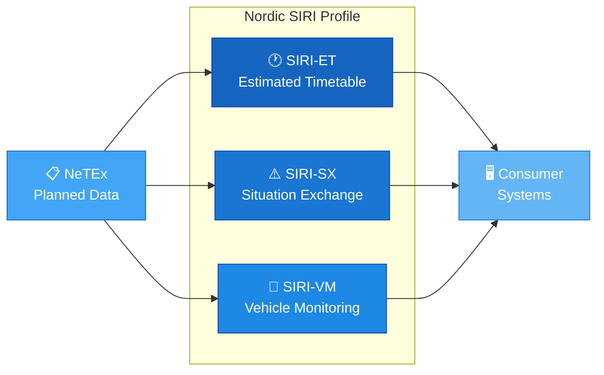
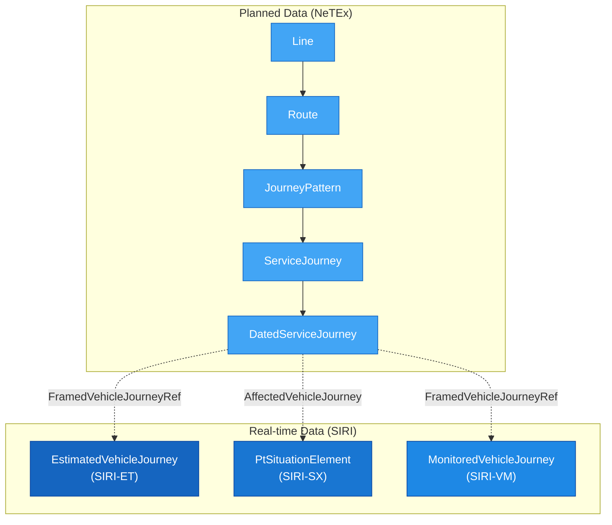

<!-- LLM AGENT: Use LLM/README.md as starting point -->
# Nordic SIRI Profile Documentation

A practical reference, learning resource, and example library for working with the Nordic SIRI Profile for real-time public transport data exchange.

This repository is a human-friendly entry point to SIRI: a place to learn the structure of the standard, explore real examples, and understand how the three services (ET, SX, VM) work in the Nordic context.

- 📘 **Learn** the concepts and structure of SIRI real-time data
- 🧭 **Navigate** services, objects, and data exchange patterns
- 🗂️ **Explore** a high-quality example library aligned with the Nordic SIRI Profile
- 🔎 **Reference** element ordering, cardinality, and profile-specific requirements

---

## 📚 How to Use This Repository

### Start here

| Step | Where | What you'll find |
|------|-------|-----------------|
| 1 | [`Guides/`](Guides/GetStarted/GetStarted_Guide.md) | Conceptual overviews, conventions, and getting started material |
| 2 | [`Services/`](Services/SIRI-ET/Description_SIRI-ET.md) | The three SIRI functional services: ET, SX, VM |
| 3 | [`Objects/`](Objects/ServiceDelivery/Description_ServiceDelivery.md) | Detailed reference for every SIRI object with examples |

### Quick lookup

- 📋 [**Table of Contents**](LLM/Tables/TableOfContent.md) — Complete index of all Guides, Services, and Objects
- 📄 [**Examples Catalogue**](Services/SIRI-ET/Examples/) — XML examples for each service

---

## 🎯 What This Repository Contains

### 1. **Real-time SIRI examples**
Every XML example is:
- Aligned with the Nordic SIRI Profile v1.1
- Designed to illustrate a single use case clearly
- Built using the standard SIRI delivery pattern:

```xml
Siri → ServiceDelivery → [ET|SX|VM]Delivery → …
```

### 2. **Structured documentation per service and object**
For every service and shared object, you will find:

| File | Purpose |
|------|---------|
| `Description_<Name>.md` | Purpose, structure overview, key elements, and relationships |
| `Table_<Name>.md` | Element-level specification with types, cardinality, and descriptions |
| `Example_<Name>.xml` | One or more validated XML examples |

### 3. **Guides**
Each guide lives in its own folder under `Guides/`:

| Guide | Description |
|-------|-------------|
| [GetStarted](Guides/GetStarted/GetStarted_Guide.md) | Minimal steps to begin working with the SIRI profile |
| [GeneralInformation](Guides/GeneralInformation/GeneralInformation_Guide.md) | SIRI overview, the Nordic profile, and common conventions |
| [DataExchange](Guides/DataExchange/DataExchange_Guide.md) | Communication patterns: Pub/Sub, Request/Response |
| [Glossary](Guides/Glossary/Glossary.md) | Terminology and definitions |

---

## 🔧 The Nordic SIRI Profile

The Nordic SIRI Profile is a local profile of the SIRI 2.0 standard (CEN/TS 15531), specifying which parts of the wider format to use for exchanging real-time public transport data in the Nordic countries.

### Three services



| Service | Code | Purpose |
|---------|------|---------|
| [Estimated Timetable](Services/SIRI-ET/Description_SIRI-ET.md) | SIRI-ET | Continuous updates to planned timetable data within the same operating day |
| [Situation Exchange](Services/SIRI-SX/Description_SIRI-SX.md) | SIRI-SX | Textual traffic situation messages about disruptions and deviations |
| [Vehicle Monitoring](Services/SIRI-VM/Description_SIRI-VM.md) | SIRI-VM | Real-time vehicle positions and progress information |

### Relationship to NeTEx

SIRI builds on planned data delivered via [NeTEx](https://github.com/hfjelstad/Profile_Documentation_v2). Real-time data references planned objects (Lines, Routes, VehicleJourneys, StopPlaces) using their NeTEx IDs:



---

## 📁 Repository Structure

```
README.md                         ← You are here
Guides/                           ← Conceptual guides and getting started
  ├── GetStarted/
  ├── GeneralInformation/
  ├── DataExchange/
  └── Glossary/
Services/                         ← The three SIRI functional services
  ├── SIRI-ET/                    ← Estimated Timetable
  ├── SIRI-SX/                    ← Situation Exchange
  └── SIRI-VM/                    ← Vehicle Monitoring
Objects/                          ← Shared data structures
  ├── ServiceDelivery/
  ├── EstimatedVehicleJourney/
  ├── EstimatedCall/
  ├── RecordedCall/
  ├── PtSituationElement/
  ├── MonitoredVehicleJourney/
  ├── VehicleActivity/
  ├── Affects/
  └── FramedVehicleJourneyRef/
LLM/                              ← Documentation standards and agent guidelines
  ├── Templates/
  ├── Tables/
  └── AgentGuides/
```

---

## ✨ Interactive Features

This documentation is powered by [Docsify](https://docsify.js.org/) and includes:

| Feature | What it does |
|---------|-------------|
| 🔍 **Full-text search** | Search across all documentation pages |
| 📋 **Copy code** | One-click copy button on all XML and code blocks |
| 📑 **Tabs** | Side-by-side comparisons of profile variants |
| ⚠️ **Flexible alerts** | Styled `[!NOTE]`, `[!WARNING]`, `[!TIP]` callout boxes |
| 📊 **Mermaid diagrams** | Interactive flowcharts and relationship diagrams |
| 💬 **Glossary tooltips** | Hover over terms to see definitions |

---

## 📖 Key Resources

| Resource | Link |
|----------|------|
| SIRI XSD Schemas | [SIRI-CEN/SIRI on GitHub](https://github.com/SIRI-CEN/SIRI) |
| Nordic SIRI Profile (Wiki) | [Entur Atlassian Wiki](https://entur.atlassian.net/wiki/spaces/PUBLIC/pages/637370420/Nordic+SIRI+Profile) |
| Norwegian SIRI XML Examples | [entur/profile-norway-examples](https://github.com/entur/profile-norway-examples/tree/master/siri) |
| NeTEx Profile Documentation | [Profile_Documentation_v2](https://github.com/hfjelstad/Profile_Documentation_v2) |
| SIRI Official Site | [vdv.de/siri](https://www.vdv.de/siri.aspx) |
| Transmodel | [transmodel-cen.eu](http://transmodel-cen.eu/) |
