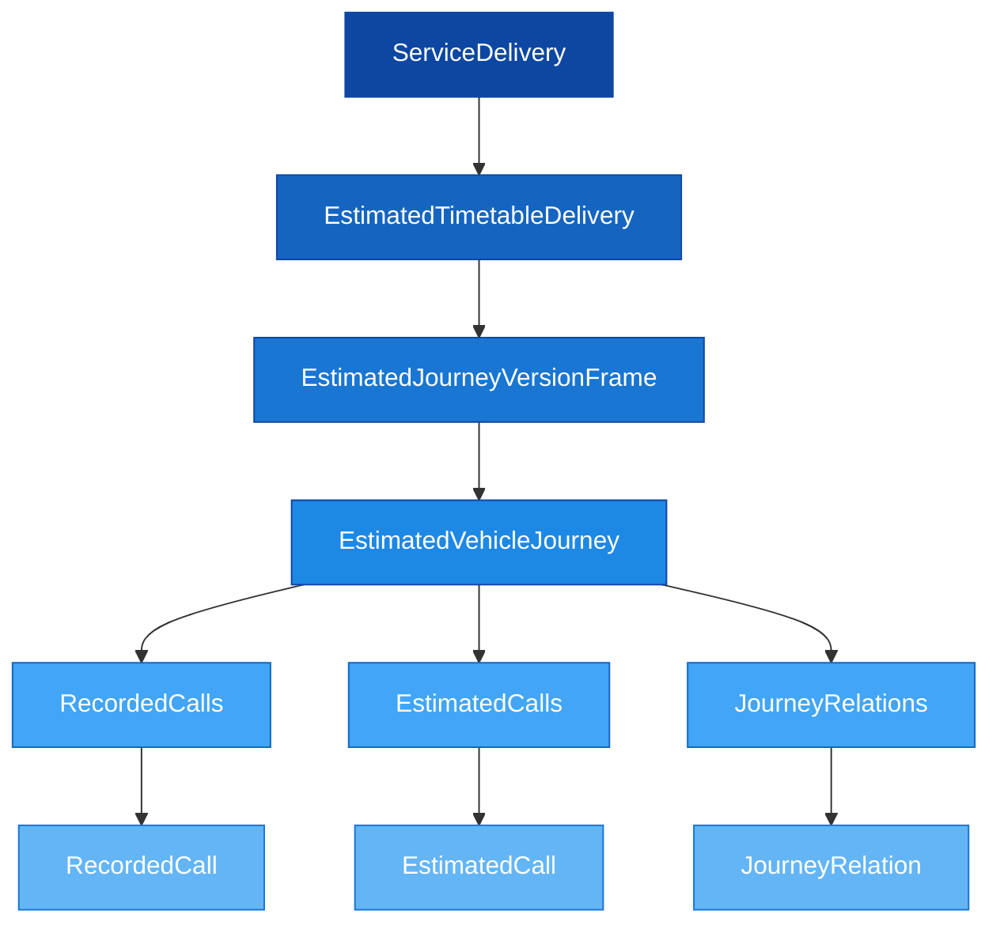

# 🕐 SIRI-ET — Estimated Timetable

## 1. Purpose

SIRI-ET (Estimated Timetable) is used to exchange continuous changes to planned timetable data within the **same operating day**. It models the status of existing VehicleJourneys and ensures that deviations such as cancellations, additional departures, delays, detours, and changes in stops can be published on short notice.

The data is linked to objects in planned NeTEx data by use of IDs, which ensures data quality and traceability.

---

## 2. Structure Overview



```
📄 EstimatedTimetableDelivery (1..1)
├── 📄 version (1..1)
├── 📄 ResponseTimestamp (1..1)
└── 📁 EstimatedJourneyVersionFrame (1..n)
    ├── 📄 RecordedAtTime (1..1)
    └── 📁 EstimatedVehicleJourney (1..n)
        ├── 📄 RecordedAtTime (1..1)
        ├── 🔗 LineRef (1..1)
        ├── 📄 DirectionRef (1..1)
        ├── 🔗 FramedVehicleJourneyRef (1..1) [choice]
        ├── 📄 ExtraJourney (0..1) [choice]
        ├── 📄 Cancellation (0..1) [choice]
        ├── 📄 DataSource (1..1)
        ├── 📁 RecordedCalls (0..1)
        │   └── 📁 RecordedCall (1..n)
        ├── 📁 EstimatedCalls (0..1)
        │   └── 📁 EstimatedCall (1..n)
        ├── 📄 IsCompleteStopSequence (1..1)
        └── 📁 JourneyRelations (0..1)
```

---

## 3. Data Requirements

> [!NOTE]
> When sending Estimated Timetable data, information should always contain **all stops**: all served EstimatedCalls with relevant RecordedCalls, and `IsCompleteStopSequence` must be `true`.

- The entire dataset must be contained within a single XML file
- Multiple `EstimatedVehicleJourney` elements per delivery are permitted
- RecordedCalls and EstimatedCalls must be in **chronological order**

---

## 4. Key Use Cases

### Delays
Update `ExpectedArrivalTime` and `ExpectedDepartureTime` for affected EstimatedCalls.

### Full Cancellation
Set `<Cancellation>true</Cancellation>` on the `EstimatedVehicleJourney`.

### Partial Cancellation
Set `<Cancellation>true</Cancellation>` on individual EstimatedCalls for cancelled stops, with `<ArrivalStatus>cancelled</ArrivalStatus>` and `<DepartureStatus>cancelled</DepartureStatus>`.

### Extra/Replacement Departures
Set `<ExtraJourney>true</ExtraJourney>` and provide a new `EstimatedVehicleJourneyCode`. Mandatory extra fields for replacement departures:
- `VehicleMode`
- `RouteRef`
- `GroupOfLinesRef`

### Changed Platform
Update `ArrivalStopAssignment` or `DepartureStopAssignment` in the relevant EstimatedCall with the new `ExpectedQuayRef`.

---

## 5. Example: Partial Cancellation

A train running Vinstra → Trondheim is cancelled from Dombås onwards. The last served stop (Dombås) has `<DepartureStatus>cancelled</DepartureStatus>`, while subsequent stops have `<Cancellation>true</Cancellation>`:

```xml
<Siri xmlns="http://www.siri.org.uk/siri" version="2.0">
  <ServiceDelivery>
    <ResponseTimestamp>2018-04-18T10:26:55</ResponseTimestamp>
    <ProducerRef>NSB</ProducerRef>
    <EstimatedTimetableDelivery version="2.0">
      <ResponseTimestamp>2018-04-18T10:26:55</ResponseTimestamp>
      <EstimatedJourneyVersionFrame>
        <RecordedAtTime>2018-04-18T10:26:51</RecordedAtTime>
        <EstimatedVehicleJourney>
          <RecordedAtTime>2018-04-18T10:26:51</RecordedAtTime>
          <LineRef>NSB:Line:21</LineRef>
          <DirectionRef>Trondheim</DirectionRef>
          <FramedVehicleJourneyRef>
            <DataFrameRef>2018-04-18</DataFrameRef>
            <DatedVehicleJourneyRef>NSB:ServiceJourney:1-2492-2343</DatedVehicleJourneyRef>
          </FramedVehicleJourneyRef>
          <VehicleMode>rail</VehicleMode>
          <OriginName>Vinstra</OriginName>
          <OperatorRef>NSB</OperatorRef>
          <EstimatedCalls>
            <!-- Normal stops ... -->
            <EstimatedCall>
              <StopPointRef>NSR:Quay:1059</StopPointRef>
              <Order>5</Order>
              <StopPointName>Dombås</StopPointName>
              <AimedArrivalTime>2018-04-18T14:02:00+02:00</AimedArrivalTime>
              <ExpectedArrivalTime>2018-04-18T14:02:00+02:00</ExpectedArrivalTime>
              <ArrivalStatus>onTime</ArrivalStatus>
              <!-- Last served stop: departure cancelled -->
              <DepartureStatus>cancelled</DepartureStatus>
              <DepartureBoardingActivity>noBoarding</DepartureBoardingActivity>
            </EstimatedCall>
            <EstimatedCall>
              <StopPointRef>NSR:Quay:519</StopPointRef>
              <Order>6</Order>
              <StopPointName>Oppdal</StopPointName>
              <!-- Cancelled stop -->
              <Cancellation>true</Cancellation>
              <ArrivalStatus>cancelled</ArrivalStatus>
              <ArrivalBoardingActivity>noAlighting</ArrivalBoardingActivity>
              <DepartureStatus>cancelled</DepartureStatus>
              <DepartureBoardingActivity>noBoarding</DepartureBoardingActivity>
            </EstimatedCall>
            <!-- ... more cancelled stops ... -->
          </EstimatedCalls>
          <IsCompleteStopSequence>true</IsCompleteStopSequence>
        </EstimatedVehicleJourney>
      </EstimatedJourneyVersionFrame>
    </EstimatedTimetableDelivery>
  </ServiceDelivery>
</Siri>
```

> [!WARNING]
> - `IsCompleteStopSequence` must always be `true` — the message must contain **all** stops
> - The last served stop does **not** get `<Cancellation>true</Cancellation>`, only `<DepartureStatus>cancelled</DepartureStatus>`
> - RecordedCalls and EstimatedCalls must be in **strict chronological order**

---

## 6. Components Reference

| Component | Description | Documentation |
|-----------|-------------|---------------|
| EstimatedTimetableDelivery | Top-level delivery wrapper | [Table](Table_SIRI-ET.md) |
| EstimatedVehicleJourney | Journey-level real-time data | [Description](../../Objects/EstimatedVehicleJourney/Description_EstimatedVehicleJourney.md) |
| EstimatedCall | Per-stop estimated data | [Description](../../Objects/EstimatedCall/Description_EstimatedCall.md) |
| RecordedCall | Per-stop recorded data | [Description](../../Objects/RecordedCall/Description_RecordedCall.md) |
| FramedVehicleJourneyRef | Journey reference with date | [Description](../../Objects/FramedVehicleJourneyRef/Description_FramedVehicleJourneyRef.md) |

---

## 7. Related Examples

| Example | Description | Link |
|---------|-------------|------|
| Partial cancellation (last stops) | Train cancelled from Dombås onwards | [GitHub](https://github.com/entur/profile-norway-examples/blob/master/siri/estimated-timetable/siri-et-partial-cancellation-last-stops.xml) |
| Partial cancellation (first leg) | Front portion of journey cancelled | [GitHub](https://github.com/entur/profile-norway-examples/blob/master/siri/estimated-timetable/siri-et-partial-cancellation-first-stops.xml) |
| Changed platform | Platform change at a stop | [GitHub](https://github.com/entur/profile-norway-examples/blob/master/siri/estimated-timetable/) |
| After departure cancellation | Cancellation while en route | [GitHub](https://github.com/entur/profile-norway-examples/blob/master/siri/estimated-timetable/siri-et-partial-cancellation-last-stops-after-departure.xml) |
