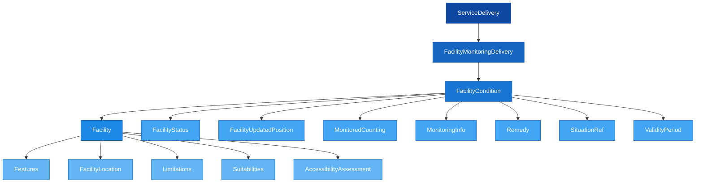

# 🏗️ SIRI-FM — Facility Monitoring

## 1. Purpose

SIRI-FM (Facility Monitoring) is used to exchange **status updates on Public Transport facilities** such as ramps, lifts, and escalators. It models the current condition of facilities and allows detailed, machine-readable information about facility accessibility.

The data is linked to objects in planned data (NeTEx/IFOPT) by use of IDs, which ensures data quality. SIRI-FM utilises **IFOPT** (Identification of Fixed Objects in Public Transport, CEN standard EN 28701) and especially **ACSB** (Accessibility Support for People with Reduced Mobility) for defining specific accessibility characteristics.

---

## 2. Structure Overview



```
📄 FacilityMonitoringDelivery (1..1)
├── 📄 version (1..1)
├── 📄 ResponseTimestamp (1..1)
└── 📁 FacilityCondition (1..n)
    ├── 📁 Facility (1..1) [choice with FacilityRef]
    │   ├── 📄 FacilityCode (0..1)
    │   ├── 📄 Description (0..n)
    │   ├── 📄 FacilityClass (0..n)
    │   ├── 📁 Features (0..1)
    │   │   └── 📁 Feature (1..n)
    │   ├── 🔗 OwnerRef (0..1)
    │   ├── 📄 OwnerName (0..1)
    │   ├── 📁 ValidityCondition (0..1)
    │   ├── 📁 FacilityLocation (0..1)
    │   ├── 📁 Limitations (0..1)
    │   ├── 📁 Suitabilities (0..1)
    │   └── 📁 AccessibilityAssessment (0..1)
    ├── 🔗 FacilityRef (1..1) [choice with Facility]
    ├── 📁 FacilityStatus (1..1)
    │   ├── 📄 Status (1..1)
    │   ├── 📄 Description (0..n)
    │   └── 📁 AccessibilityAssessment (0..1)
    ├── 📁 FacilityUpdatedPosition (0..1)
    ├── 📁 MonitoredCounting (0..n)
    │   ├── 📄 CountingType (1..1)
    │   ├── 📄 CountedFeatureUnit (0..1)
    │   ├── 📄 Count / Percentage (1..1)
    │   ├── 📄 Trend (0..1)
    │   └── 📄 Accuracy (0..1)
    ├── 📁 MonitoringInfo (0..1)
    ├── 📁 Remedy (0..1)
    ├── 🔗 SituationRef (0..1)
    └── 📁 ValidityPeriod (0..1)
```

---

## 3. Data Requirements

> [!NOTE]
> When sending SIRI-FM data, the entire dataset must be contained within a **single XML file** and must be in accordance with this profile.

- Multiple `FacilityCondition` elements per `FacilityMonitoringDelivery` are permitted, allowing real-time information to be conflated and transferred as part of the same `ServiceDelivery`
- Each `FacilityCondition` must reference a facility either inline (`Facility`) or by reference (`FacilityRef`) — not both
- Facility identifiers must correspond to objects in planned data (NeTEx/IFOPT)

---

## 4. Key Use Cases

### Facility Status Reporting
Report the current status of a facility (lift, escalator, ramp) as `available`, `notAvailable`, or `partiallyAvailable`:

```xml
<FacilityCondition>
    <FacilityRef>NSR:Facility:LIFT-001</FacilityRef>
    <FacilityStatus>
        <Status>notAvailable</Status>
        <Description xml:lang="no">Heisen er ute av drift grunnet vedlikehold</Description>
    </FacilityStatus>
</FacilityCondition>
```

### Accessibility Impact
When a facility change affects accessibility, include an `AccessibilityAssessment` with specific `Limitations` to indicate how the change impacts users with reduced mobility:

```xml
<FacilityStatus>
    <Status>notAvailable</Status>
    <AccessibilityAssessment>
        <MobilityImpairedAccess>false</MobilityImpairedAccess>
        <Limitations>
            <Limitation>
                <WheelchairAccess>false</WheelchairAccess>
                <StepFreeAccess>false</StepFreeAccess>
                <LiftFreeAccess>true</LiftFreeAccess>
            </Limitation>
        </Limitations>
    </AccessibilityAssessment>
</FacilityStatus>
```

### Counting and Monitoring
Track quantitative values such as seat availability, charging levels, or available parking bays using `MonitoredCounting`:

```xml
<MonitoredCounting>
    <CountingType>availabilityCount</CountingType>
    <CountedFeatureUnit>bays</CountedFeatureUnit>
    <Count>12</Count>
    <Trend>decreasing</Trend>
</MonitoredCounting>
```

### Remedy Information
Describe actions being taken to resolve a facility issue and provide an expected restoration timeframe:

```xml
<Remedy>
    <RemedyType>repair</RemedyType>
    <Description xml:lang="en">Technician dispatched, estimated repair by end of day</Description>
    <RemedyPeriod>
        <StartTime>2026-02-16T08:00:00+01:00</StartTime>
        <EndTime>2026-02-16T18:00:00+01:00</EndTime>
    </RemedyPeriod>
</Remedy>
```

### Linking to SIRI-SX Situations
A facility condition can reference a previously published SIRI-SX situation using `SituationRef`, allowing correlation between facility status and broader disruption information:

```xml
<SituationRef>
    <SituationSimpleRef>ENT:SituationNumber:12345</SituationSimpleRef>
</SituationRef>
```

---

## 5. Example: Facility Monitoring Delivery

An escalator at a stop place is out of service, with accessibility impact and a repair remedy:

```xml
<Siri xmlns="http://www.siri.org.uk/siri" version="2.0">
  <ServiceDelivery>
    <ResponseTimestamp>2026-02-16T10:00:00+01:00</ResponseTimestamp>
    <ProducerRef>ENT</ProducerRef>
    <FacilityMonitoringDelivery version="2.0">
      <ResponseTimestamp>2026-02-16T10:00:00+01:00</ResponseTimestamp>
      <FacilityCondition>
        <Facility>
          <FacilityCode>NSR:Facility:ESC-042</FacilityCode>
          <Description xml:lang="en">Main escalator, platform level to street</Description>
          <FacilityClass>fixedEquipment</FacilityClass>
          <Features>
            <Feature>
              <AccessFacility>escalator</AccessFacility>
            </Feature>
          </Features>
          <FacilityLocation>
            <StopPlaceRef>NSR:StopPlace:337</StopPlaceRef>
            <StopPlaceComponentId>NSR:Quay:553</StopPlaceComponentId>
          </FacilityLocation>
          <AccessibilityAssessment>
            <MobilityImpairedAccess>true</MobilityImpairedAccess>
            <Limitations>
              <Limitation>
                <WheelchairAccess>true</WheelchairAccess>
                <StepFreeAccess>true</StepFreeAccess>
                <EscalatorFreeAccess>false</EscalatorFreeAccess>
              </Limitation>
            </Limitations>
          </AccessibilityAssessment>
        </Facility>
        <FacilityStatus>
          <Status>notAvailable</Status>
          <Description xml:lang="en">Escalator out of service due to mechanical failure</Description>
          <AccessibilityAssessment>
            <MobilityImpairedAccess>false</MobilityImpairedAccess>
            <Limitations>
              <Limitation>
                <WheelchairAccess>false</WheelchairAccess>
                <StepFreeAccess>false</StepFreeAccess>
                <EscalatorFreeAccess>true</EscalatorFreeAccess>
              </Limitation>
            </Limitations>
          </AccessibilityAssessment>
        </FacilityStatus>
        <Remedy>
          <RemedyType>repair</RemedyType>
          <Description xml:lang="en">Repair crew dispatched</Description>
          <RemedyPeriod>
            <StartTime>2026-02-16T08:00:00+01:00</StartTime>
            <EndTime>2026-02-16T18:00:00+01:00</EndTime>
          </RemedyPeriod>
        </Remedy>
        <ValidityPeriod>
          <StartTime>2026-02-16T07:30:00+01:00</StartTime>
          <EndTime>2026-02-16T18:00:00+01:00</EndTime>
        </ValidityPeriod>
      </FacilityCondition>
    </FacilityMonitoringDelivery>
  </ServiceDelivery>
</Siri>
```

> [!WARNING]
> - Each `FacilityCondition` must use **either** `Facility` (inline) **or** `FacilityRef` (by reference) — not both
> - `FacilityStatus` is mandatory and must always contain a `Status` value
> - When `AccessibilityAssessment` is provided in `FacilityStatus`, it represents the *current* (changed) accessibility — the one in `Facility` represents the *normal* accessibility

---

## 6. Facility Status Values

| Value | Meaning |
|-------|---------|
| `unknown` | Status is not known |
| `available` | Facility is fully operational |
| `notAvailable` | Facility is completely out of service |
| `partiallyAvailable` | Facility has reduced capacity or function |
| `added` | A new facility has been added |
| `removed` | A facility has been removed |

---

## 7. Facility Feature Categories

The `Features` element in `FacilityStructure` classifies what type of facility is being monitored. Each feature uses one of these category enumerations:

| Feature Type | Examples |
|-------------|----------|
| `AccessFacility` | lift, escalator, ramp, stairs, travelator, validator |
| `AccommodationFacility` | sleeper, couchette, specialSeating, familyCarriage |
| `AssistanceFacility` | firstAid, boardingAssistance, unaccompaniedMinorAssistance |
| `MobilityFacility` | suitableForWheelChairs, lowFloor, stepFreeAccess, tactilePlatformEdges |
| `ParkingFacility` | carPark, cyclePark, parkAndRidePark |
| `SanitaryFacility` | toilet, wheelchairAccessToilet, babyChange |
| `TicketingFacility` | ticketMachines, ticketOffice, mobileTicketing |
| `PassengerInformationFacility` | nextStopIndicator, passengerInformationDisplay |
| `RefreshmentFacility` | restaurantService, beverageVendingMachine |
| `ReservedSpaceFacility` | lounge, shelter, seats |
| `RetailFacility` | cashMachine, currencyExchange |

---

## 8. Monitored Counting

`MonitoredCounting` enables quantitative monitoring of facility characteristics:

| CountingType | Use case |
|-------------|----------|
| `availabilityCount` | Number of available units (seats, bays, etc.) |
| `reservedCount` | Number of reserved units |
| `inUseCount` | Number currently in use |
| `outOfOrderCount` | Number out of order |
| `presentCount` | Number present |
| `chargingLevel` | Battery/charging level |
| `availableRunningDistance` | Remaining range |
| `currentStateCount` | General state count |

Values can be expressed as a `Count` (integer) or `Percentage` (0.0–100.0), with an optional `Trend` (increasing, decreasing, stable, etc.).

---

## 9. Components Reference

| Component | Description | Documentation |
|-----------|-------------|---------------|
| FacilityMonitoringDelivery | Top-level delivery wrapper | [Table](Table_SIRI-FM.md) |
| ServiceDelivery | Parent container for all deliveries | [Description](../../Objects/ServiceDelivery/Description_ServiceDelivery.md) |

---

## 10. Related Examples

| Example | Description |
|---------|-------------|
| Minimal delivery | Service delivery request (no filtering) with multiple facility conditions and statuses |
| Accessibility-filtered | Service delivery request with accessibility needs filter and response with facility status change affecting accessibility |
