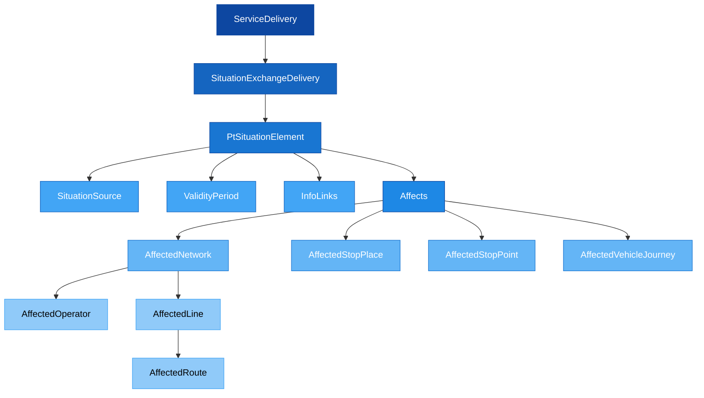
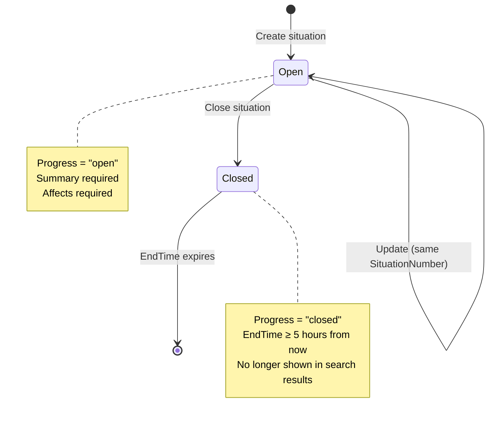

# ⚠️ SIRI-SX — Situation Exchange

## 1. Purpose

SIRI-SX (Situation Exchange) is used to exchange textual descriptions of disruptions or deviations from planned public transport information. Messages can be applied directly to stops, lines, vehicles, etc. using ID references to existing planned data.

SIRI-SX models:
- **Planned deviations** — maintenance work, road construction
- **Unplanned deviations** — accidents, equipment failures, severe weather

---

## 2. Structure Overview



```
📄 SituationExchangeDelivery (1..1)
├── 📄 version (1..1)
├── 📄 ResponseTimestamp (1..1)
└── 📁 Situations (1..n)
    └── 📁 PtSituationElement
        ├── 📄 CreationTime (1..1)
        ├── 📄 ParticipantRef (1..1)
        ├── 📄 SituationNumber (1..1)
        ├── 📄 Version (0..1)
        ├── 📁 Source (1..1)
        ├── 📄 VersionedAtTime (0..1)
        ├── 📄 Progress (1..1) — open | closed
        ├── 📁 ValidityPeriod (1..n)
        ├── 📄 UndefinedReason (1..1)
        ├── 📄 Severity (0..1)
        ├── 📄 Priority (0..1)
        ├── 📄 ReportType (1..1) — general | incident
        ├── 📄 Planned (0..1)
        ├── 📄 Summary (1..n)
        ├── 📄 Description (0..n)
        ├── 📄 Advice (0..n)
        ├── 📁 InfoLinks (0..1)
        └── 📁 Affects (1..1)
            ├── 📁 Networks → AffectedNetwork
            ├── 📁 StopPlaces → AffectedStopPlace
            ├── 📁 StopPoints → AffectedStopPoint
            └── 📁 VehicleJourneys → AffectedVehicleJourney
```

---

## 3. Data Requirements

> [!NOTE]
> It is permitted for client systems to send more than one `PtSituationElement` per `SituationExchangeDelivery`, allowing multiple situations to be transferred in the same `ServiceDelivery`.

- The entire dataset must be contained within a single XML file
- `Affects` must have content unless `Progress` is `closed`
- `Summary` can be empty (0) when `Progress` is `closed`

---

## 4. Message Lifecycle



### Opening a Situation
Set `<Progress>open</Progress>` with a `ValidityPeriod`.

<!-- tabs:start -->

#### **Time-limited**
Known end time:
```xml
<Progress>open</Progress>
<ValidityPeriod>
    <StartTime>2018-02-11T11:33:11</StartTime>
    <EndTime>2018-04-22T22:55:00</EndTime>
</ValidityPeriod>
```

#### **Open-ended**
Unknown end time (no `EndTime`):
```xml
<Progress>open</Progress>
<ValidityPeriod>
    <StartTime>2018-02-11T11:33:11</StartTime>
</ValidityPeriod>
```

<!-- tabs:end -->

### Closing a Situation
Update the message with the same `SituationNumber`, set `<Progress>closed</Progress>`, and provide an `EndTime`:

```xml
<Progress>closed</Progress>
<ValidityPeriod>
    <StartTime>2018-02-11T11:33:11</StartTime>
    <EndTime>2018-02-12T20:10:00</EndTime>
</ValidityPeriod>
```

> [!WARNING]
> - When closing a message, `EndTime` must be set to **at least 5 hours into the future** to ensure all systems receive the close-message
> - Once `EndTime` has expired, the message will no longer be re-distributed
> - A closed message is still available in real-time streams until `EndTime` passes

---

## 5. The Affects Structure

The `Affects` element describes **what** is impacted by the situation. It uses a choice of four target types:

| Target | What it affects | Key reference |
|--------|----------------|---------------|
| `Networks` | Operators and lines | `NetworkRef`, `AffectedLine` |
| `StopPlaces` | Physical stops | `StopPlaceRef` |
| `StopPoints` | Logical stop points (Quays) | `StopPointRef` with optional `StopCondition` |
| `VehicleJourneys` | Specific trips | `VehicleJourneyRef` or `FramedVehicleJourneyRef` |

### StopCondition Values
When affecting a stop, `StopCondition` specifies which passengers the message applies to:

| Value | Meaning |
|-------|---------|
| `stop` | Default — affects all interactions (boarding, alighting) |
| `startPoint` | At departure or when passengers expect to board |
| `destination` | For passengers expecting to disembark |
| `notStopping` | When passing a stop |
| `requestStop` | When a passenger must request the stop |
| `exceptionalStop` | For passengers expecting an interchange |

---

## 6. Components Reference

| Component | Description | Documentation |
|-----------|-------------|---------------|
| SituationExchangeDelivery | Top-level delivery wrapper | [Table](Table_SIRI-SX.md) |
| PtSituationElement | Core situation data object | [Description](../../Objects/PtSituationElement/Description_PtSituationElement.md) |
| Affects | What the situation impacts | [Description](../../Objects/Affects/Description_Affects.md) |

---

## 7. Related Examples

| Example | Description | Link |
|---------|-------------|------|
| Time-bound message | Situation with defined end time | [GitHub](https://github.com/entur/profile-norway-examples/blob/master/siri/situation-exchange/siri-sx-timebound.xml) |
| Open-ended message | Situation without end time | [GitHub](https://github.com/entur/profile-norway-examples/blob/master/siri/situation-exchange/siri-sx-open-ended.xml) |
| Close message | Closing a previously open situation | [GitHub](https://github.com/entur/profile-norway-examples/blob/master/siri/situation-exchange/siri-sx-close.xml) |
| Message on a Line | Situation affecting a specific line | [Wiki](https://entur.atlassian.net/wiki/spaces/PUBLIC/pages/637370744/SIRI-SX+-+Message+on+a+Line) |
| Message on a stop | Situation affecting a single stop | [Wiki](https://entur.atlassian.net/wiki/spaces/PUBLIC/pages/637370748/SIRI-SX+-+Message+on+a+single+stop) |
| Message on a vehicle | Situation affecting a vehicle | [Wiki](https://entur.atlassian.net/wiki/spaces/PUBLIC/pages/637370806/SIRI+SX+-+Message+on+a+vehicle) |
