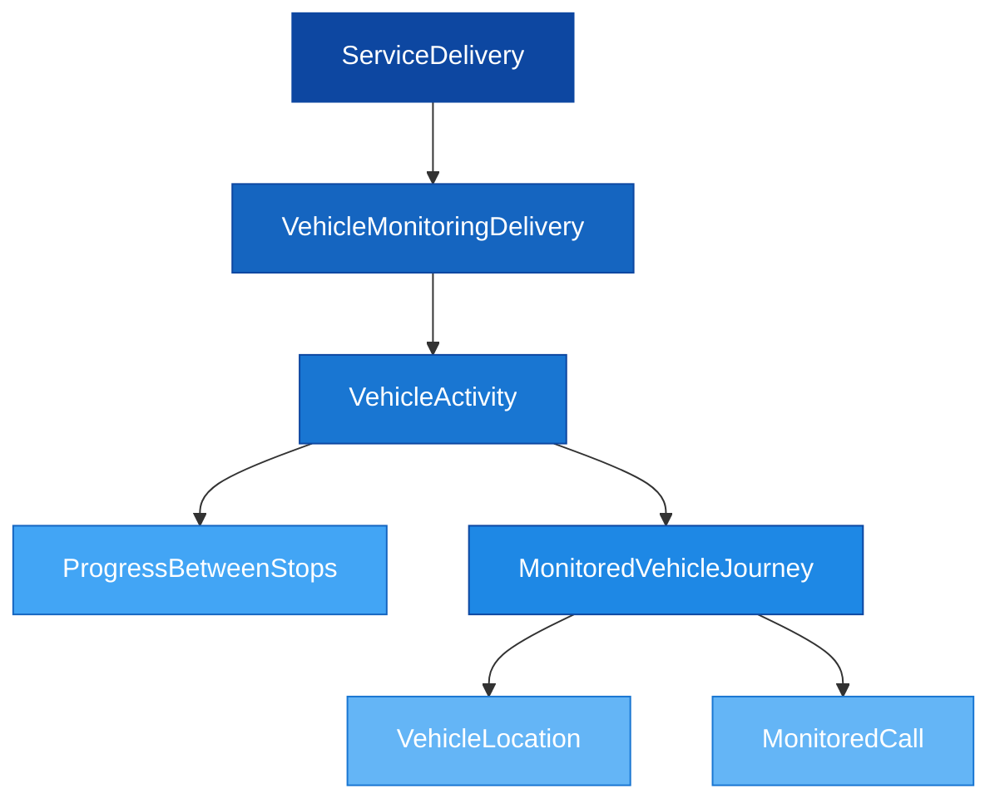

# 📍 SIRI-VM — Vehicle Monitoring

## 1. Purpose

SIRI-VM (Vehicle Monitoring) is used to exchange updates on vehicle position and status, as well as estimated delays. It models vehicle movements and their progress compared to a planned timetable.

The data is linked to objects in planned NeTEx data by use of IDs, which ensures data quality and traceability.

> [!NOTE]
> It is a fundamental requirement that valid timetable data (as NeTEx or SIRI-ET data) is delivered **before** sending position and status information as SIRI-VM.

---

## 2. Structure Overview



```
📄 VehicleMonitoringDelivery (1..1)
├── 📄 version (1..1)
├── 📄 ResponseTimestamp (1..1)
└── 📁 VehicleActivity (1..n)
    ├── 📄 RecordedAtTime (1..1)
    ├── 📄 ValidUntilTime (1..1)
    ├── 📁 ProgressBetweenStops (0..1)
    │   ├── 📄 LinkDistance (0..1)
    │   └── 📄 Percentage (1..1)
    └── 📁 MonitoredVehicleJourney (1..1)
        ├── 🔗 LineRef (1..1)
        ├── 📄 DirectionRef (0..1)
        ├── 🔗 FramedVehicleJourneyRef (0..1)
        ├── 📄 VehicleMode (0..1)
        ├── 🔗 OperatorRef (0..1)
        ├── 📄 Monitored (0..1)
        ├── 📄 DataSource (1..1)
        ├── 📁 VehicleLocation (1..1)
        │   ├── 📄 Longitude (1..1) [choice]
        │   ├── 📄 Latitude (1..1) [choice]
        │   └── 📄 Coordinates [choice]
        ├── 📄 Bearing (0..1)
        ├── 📄 Velocity (0..1)
        ├── 📄 Occupancy (0..1)
        ├── 📄 Delay (1..1)
        ├── 📄 VehicleStatus (0..1)
        ├── 🔗 VehicleRef (1..1)
        ├── 📁 MonitoredCall (0..1)
        └── 📄 IsCompleteStopSequence (1..1) — always false
```

---

## 3. Data Requirements

> [!NOTE]
> When sending Vehicle Monitoring data, information should be limited to the **MonitoredCall** only (the previous or current stop), and `IsCompleteStopSequence` must be `false`.

- The entire dataset must be contained within a single XML file
- Multiple `VehicleActivity` elements per delivery are permitted
- Valid NeTEx or SIRI-ET data must exist before sending SIRI-VM

---

## 4. Key Elements

### VehicleLocation
The position of the vehicle as a geospatial point, using WGS84 coordinates:

```xml
<VehicleLocation>
    <Longitude>10.7522</Longitude>
    <Latitude>59.9139</Latitude>
</VehicleLocation>
```

### Delay
The delay as an ISO 8601 duration. `PT0S` means no delay:

```xml
<Delay>PT5M30S</Delay>  <!-- 5 minutes 30 seconds delay -->
<Delay>PT0S</Delay>      <!-- On time -->
```

### VehicleStatus
Current operational status of the vehicle:

| Value | Meaning |
|-------|---------|
| `assigned` | Vehicle assigned but not yet deployed |
| `atOrigin` | Journey has not begun, vehicle at first stop |
| `cancelled` | Journey is cancelled |
| `completed` | Journey has been completed |
| `inProgress` | Journey is underway |
| `offRoute` | Vehicle is taking a detour |

### Journey Reference
Either `FramedVehicleJourneyRef` (ServiceJourneyId + Date) **or** `VehicleJourneyRef` (DatedServiceJourneyId) must be set:

<!-- tabs:start -->

#### **FramedVehicleJourneyRef**
```xml
<FramedVehicleJourneyRef>
    <DataFrameRef>2024-01-15</DataFrameRef>
    <DatedVehicleJourneyRef>RUT:ServiceJourney:31-1234</DatedVehicleJourneyRef>
</FramedVehicleJourneyRef>
```

#### **VehicleJourneyRef**
```xml
<VehicleJourneyRef>RUT:DatedServiceJourney:31-1234-20240115</VehicleJourneyRef>
```

<!-- tabs:end -->

---

## 5. Example: Vehicle Monitoring Delivery

```xml
<Siri xmlns="http://www.siri.org.uk/siri" version="2.0">
  <ServiceDelivery>
    <ResponseTimestamp>2024-01-15T10:30:00</ResponseTimestamp>
    <ProducerRef>RUT</ProducerRef>
    <VehicleMonitoringDelivery version="2.0">
      <ResponseTimestamp>2024-01-15T10:30:00</ResponseTimestamp>
      <VehicleActivity>
        <RecordedAtTime>2024-01-15T10:29:55</RecordedAtTime>
        <ValidUntilTime>2024-01-15T10:31:00</ValidUntilTime>
        <ProgressBetweenStops>
          <LinkDistance>850</LinkDistance>
          <Percentage>65.0</Percentage>
        </ProgressBetweenStops>
        <MonitoredVehicleJourney>
          <LineRef>RUT:Line:31</LineRef>
          <DirectionRef>Fornebu</DirectionRef>
          <FramedVehicleJourneyRef>
            <DataFrameRef>2024-01-15</DataFrameRef>
            <DatedVehicleJourneyRef>RUT:ServiceJourney:31-1234</DatedVehicleJourneyRef>
          </FramedVehicleJourneyRef>
          <VehicleMode>bus</VehicleMode>
          <OperatorRef>RUT</OperatorRef>
          <Monitored>true</Monitored>
          <DataSource>RUT</DataSource>
          <VehicleLocation>
            <Longitude>10.7522</Longitude>
            <Latitude>59.9139</Latitude>
          </VehicleLocation>
          <Bearing>270.0</Bearing>
          <Velocity>45</Velocity>
          <Occupancy>fewSeatsAvailable</Occupancy>
          <Delay>PT2M</Delay>
          <VehicleStatus>inProgress</VehicleStatus>
          <VehicleRef>RUT:Vehicle:BUS-4521</VehicleRef>
          <MonitoredCall>
            <StopPointRef>NSR:Quay:11073</StopPointRef>
            <VehicleAtStop>false</VehicleAtStop>
          </MonitoredCall>
          <IsCompleteStopSequence>false</IsCompleteStopSequence>
        </MonitoredVehicleJourney>
      </VehicleActivity>
    </VehicleMonitoringDelivery>
  </ServiceDelivery>
</Siri>
```

> [!WARNING]
> - `IsCompleteStopSequence` must be `false` when only `MonitoredCall` is included
> - Either `FramedVehicleJourneyRef` or `VehicleJourneyRef` **must** be set (not both)
> - `VehicleRef` is mandatory — every vehicle must have a unique identifier

---

## 6. Components Reference

| Component | Description | Documentation |
|-----------|-------------|---------------|
| VehicleMonitoringDelivery | Top-level delivery wrapper | [Table](Table_SIRI-VM.md) |
| VehicleActivity | Activity container with timestamp | [Description](../../Objects/VehicleActivity/Description_VehicleActivity.md) |
| MonitoredVehicleJourney | Journey-level real-time data | [Description](../../Objects/MonitoredVehicleJourney/Description_MonitoredVehicleJourney.md) |
| FramedVehicleJourneyRef | Journey reference with date | [Description](../../Objects/FramedVehicleJourneyRef/Description_FramedVehicleJourneyRef.md) |
